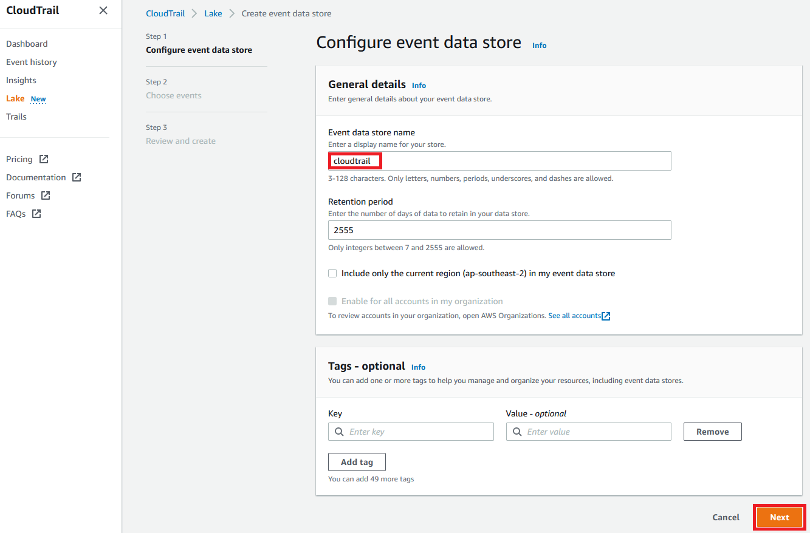

# aws-ir-credential-breach


## Preparation and Response to AWS Cloud Credential Breaches

This is a preparation and response guide for learning how to deal with credential breaches in AWS. Fircy runs training that uses this as the guide for the training course, and you can use it yourself! It's to help you learn about responding to an incident related to credential breaches in AWS. The credentials we cover in this are IAM users with an access key. Access keys can be easy to accidentally share online, especially in public repositories. This training has been designed to run in teams of 2 or more people, where you each have an AWS account and attack each other.

**WARNING**
This guide makes use of IAM users and access keys which should not be used in production. Instead of IAM users you should centralise your identities and use the [AWS Single Sign-On](https://aws.amazon.com/single-sign-on/) service. Temporary access keys and tokens with least privilege should be used instead of IAM user access keys. For more information on best practices see the [Identity and Access Management](https://docs.aws.amazon.com/wellarchitected/latest/security-pillar/identity-and-access-management.html) section of AWS Well-Architected.

## Requirements

* At least 2 [AWS accounts](https://portal.aws.amazon.com/gp/aws/developer/registration/index.html) that you are able to use for training, that are not used for production or any other purpose.
* Permission in the accounts to use the following services: IAM, CloudTrail, CloudShell, S3, Athena, GuardDuty, Config, EC2.

NOTE: AWS will charge you for any AWS resources used that are not covered in the [AWS Free Tier](https://aws.amazon.com/free/).


***


## Hands-on #1: Configure CloudTrail

In this hands-on exercise we are going to:
* Login to the AWS console
* Configure [AWS CloudTrail](https://aws.amazon.com/cloudtrail/) in your home region.
* Configure [AWS CloudTrail Lake](https://docs.aws.amazon.com/awscloudtrail/latest/userguide/cloudtrail-lake.html)

[AWS CloudTrail](https://aws.amazon.com/cloudtrail/) is a service that enables governance, compliance, operational auditing, and risk auditing of your AWS account. With CloudTrail, you can log, continuously monitor, and retain account activity related to actions across your AWS infrastructure. CloudTrail provides event history of your AWS account activity, including actions taken through the AWS Management Console, AWS SDKs, command line tools, and other AWS services. This event history simplifies security analysis, resource change tracking, and troubleshooting.

### Login to console

1.1 Login to the AWS console of your AWS account you use for testing or training.

1.2 Select your closest region from the top menu close to right hand side.

### Configure CloudTrail

1.3 Using the top menu services search or the services drop down, select *CloudTrail*.

1.4 Select *Create a trail*.


If your account already has a trail, for example an AWS provided training account, your setup experience is different:


1.5 For this training you can accept the defaults and select *Create trail*.


If your options do not look like the ones above, they will look like the ones below. Enter *management-events* as the *Trail name* and disable *Log file SSE-KMS encryption* then select *Next*, *Next* again, then *Create trail*.


1.6  Your trail is now setup! Select the name of the trail *management-events*. You can now explore the different configuration options in CloudTrail! By default it will log management events to the S3 bucket it just created for you.


### Configure CloudTrail Lake

1.7 We are now going to configure [CloudTrail Lake](https://docs.aws.amazon.com/awscloudtrail/latest/userguide/cloudtrail-lake.html) which allows us to query the data stored by CloudTrail. Enable the Lake feature by selecting *Lake* from the left menu, then *Create event data store*. 


1.8 Enter an *Event data store name* of *cloudtrail*, accept the defaults and select *Next*. 



1.9 For Choose events accept the defaults and select *Next*.


1.10 Select *Create event data store* to create the lake. You will see the next page have a status that will turn to *Enabled*.


1.11 You can now investigate the *Sample queries* and execute them against your CloudTrail.


1.12 Note that as you have only just setup CloudTrail and Lake it will normally take at least 5 minutes to start seeing events. Explore other services in the console to generate events and go back to check.

This simple query you can edit in the *Editor* allows you to test by searching for all events, replace *Event-data-store-ID* with the ID in the console:

```
SELECT * FROM Event-data-store-ID LIMIT 50
```


***


## Hands-on #2: Create IAM user with keys

In this hands-on exercise we are going to:
* Create an IAM user with an access key
* Test using CloudShell

### Create IAM user with an access key

IAM users are still commonly used by many AWS customers who have not yet adopted recommendations to use AWS Single Sign-on (SSO) or federation. It is far more likely to have an IAM user access (and secret) key breached than a temporary one from AWS SSO or a role. The steps for responding are similar for both IAM users and federated users (e.g. AWS Single Sign-On).

2.1 Follow the instructions to [Create an IAM user using the console](https://docs.aws.amazon.com/IAM/latest/UserGuide/id_users_create.html#id_users_create_console) with both console access and programmatic access, and attach existing policy directly: *AdministratorAccess*. Name it *test*. Download the credentials or store in a text file. Normally you would use a secrets management service to securely save them. 

NOTE: Never use the *AdministratorAccess* policy other than for testing or training purposes, it provides unrestricted access to all services in every region. You can learn about least privilege in the AWS blog: [Techniques for writing least privilege IAM policies](https://aws.amazon.com/blogs/security/techniques-for-writing-least-privilege-iam-policies/).

### Test using CloudShell

To use an access key you must use the AWS API, which the [AWS Command Line Interface (CLI)](https://docs.aws.amazon.com/cli/latest/userguide/cli-chap-welcome.html) uses to interact with AWS services allowing you to test without writing any code. The [AWS CLI Command Reference](https://docs.aws.amazon.com/cli/latest/index.html) documents all commands available with examples. You can install the AWS CLI in Linux, macOS, Docker and Windows, however the easiest way is to use the [AWS CloudShell](https://aws.amazon.com/cloudshell/) service. AWS CloudShell is a browser-based, pre-authenticated shell that you can launch directly from the AWS Management Console. You can run AWS CLI commands against AWS services using your preferred shell (Bash, PowerShell, or Z shell). And you can do this without needing to download or install command line tools.

2.2 Using the [CloudShell console](https://console.aws.amazon.com/cloudshell/), once your shell is prepared test your shell by running the following command to list all your IAM users:

```
aws iam list-users
```

This uses the *aws* CLI to select the *iam* service and issue *list-users* command. You will see a list of IAM users in your account in JSON format.

2.3 Now that works using your existing console credentials, test your new user and its access key that you just created. We can do this by setting an environment variable that the CLI will use. Run the following commands replacing YOUR_ACCESS_KEY and YOUR_SECRET_KEY with the ones you saved from when you created them.

```
export AWS_ACCESS_KEY_ID=YOUR_ACCESS_KEY
export AWS_SECRET_ACCESS_KEY=YOUR_SECRET_KEY
```

2.4 Run the `aws iam list-users` command again to test your new user. If you receive an error check your export commands do not have any extra spaces and the keys are identical to what you saved. If you receive a permissions error check the policy you attached to the IAM user. Note: If CloudShell times out at any stage you can simply press enter and it will resume / prepare the session again.


***


## Hands-on #3: Discover CloudTrail, test partners keys

In this hands-on exercise we are going to:
* Find the API action in CloudTrail where you created your user
* Share your access & secret key with your partner
* List account information in your partners account
* Investigate actions they performed

### Find the API action in CloudTrail where you created your user

3.1 Access the [CloudTrail console](https://console.aws.amazon.com/cloudtrail/) and select *Event history* from the left menu (you may need to skip a welcome page). These instructions are for the built-in 90 day event history for simplicity, however you may adapt to use the CloudTrail Lake you configured previously. The recent account history is displayed and you can filter the events. Each API action is a separate event, and you can expand on the details by selecting the event name. You are looking in the *Resource Name* column for the user you created, note the *User name* column is the user that initiated the request, e.g. the one you are using. 


3.2 To filter the event history for the creation of the IAM user select *Event name* from the lookup attributes, then `CreateUser` in the search field. To the right is the time period to search. Note the event may take up to 30 minutes to appear.

### Share your access & secret key with your partner

3.3 Share your access and secret key with your partner, you may choose to encrypt it in a zip archive and exchange via email or memory device. The recommended method of storing and using credentials in AWS is secrets manager, however this is a training scenario in a controlled environment with no sensitive data.

### List account information in your partners account

3.4 Following step 2.3, replace your CloudShell environment variables for the access and secret key from your partner. You should see their user name they created in the message returned instead of yours. Now you can test a few CLI commands in their account:

List managed policies attach to user *test*:
```aws iam list-attached-user-policies --user-name test```

List S3 buckets:
```aws s3 ls```

List roles:
```aws iam list-roles```

### Investigate the actions they performed

3.5 Start a new CloudShell session by simply opening the service in a new tab and verify that you are back to using your credentials again. 

3.6 Now we want to see what actions your partner has performed back in the CloudTrail console. Clear the filter by selecting *Event history* again, and as your test account doesn’t have much activity you should see their actions appear.

If you are at an event and you and your partner are ahead, experiment with other read-only type commands e.g. describe, list, get.


***


## Hands-on #4: Querying CloudTrail using Amazon Athena

In this hands-on exercise we are going to:
* Setup Amazon Athena
* Query CloudTrail logs

### Setup Amazon Athena

[Amazon Athena]( https://aws.amazon.com/athena/) is an interactive query service that makes it easy to analyze data in Amazon S3 using standard SQL. Athena is serverless, so there is no infrastructure to manage, and you pay only for the queries that you run. You can use Athena to query CloudTrail logs directly stored in S3 at scale.

4.1 The fast-track way of using Athena is by accessing the [CloudTrail console](https://console.aws.amazon.com/cloudtrail/) and select *Event history* from the right menu, then *Create Athena table* on the right.


4.2 Select your S3 bucket used for CloudTrail in *Storage location*, then select *Create table*. Select the link at the top of your browser to access the newly created Athena table.

4.3 In a new browser tab, access the [S3 console](https://console.aws.amazon.com/s3/) and create a new S3 bucket that will contain logs for the Athena service, in your primary region where you configure CloudTrail. Bucket names must be globally unique across all customers of AWS, and adhere to [bucket naming rules](https://docs.aws.amazon.com/AmazonS3/latest/userguide/bucketnamingrules.html).

4.4 Go back to the [Athena console](https://console.aws.amazon.com/athena/) tab.

4.5 Click *Get Started* to display the main Athena console.

4.6 A number of banners will be displayed, look for one *Before you run your first query, you need to set up a query result location in Amazon S3* and click the link to set up a query result location in Amazon S3.

4.7 In *Query result and encryption settings* Click *Manage*, then *Browse* and choose the bucket you created before by selecting the small right arrow next to the name. Accept the defaults then *Save*.

The steps below are for manually configuring the Athena table if the fast-track way did not work for you.

4.8 Now create the table for querying the CloudTrail logs. Athena supports both partitioned and unpartitioned tables, this example uses unpartitioned tables as the queries are easier, however if you have lots of logs then partitioning based on date or region can reduce query times. Find out more from the Athena documentation for CloudTrail. 

In the query editor insert the following query to create the table then click *Run query*, replace *CLOUDTRAIL-BUCKET-NAME* with your CloudTrail bucket name:
```
CREATE EXTERNAL TABLE cloudtrail_log (
eventversion STRING,
useridentity STRUCT<
               type:STRING,
               principalid:STRING,
               arn:STRING,
               accountid:STRING,
               invokedby:STRING,
               accesskeyid:STRING,
               userName:STRING,
sessioncontext:STRUCT<
attributes:STRUCT<
               mfaauthenticated:STRING,
               creationdate:STRING>,
sessionissuer:STRUCT<  
               type:STRING,
               principalId:STRING,
               arn:STRING, 
               accountId:STRING,
               userName:STRING>>>,
eventtime STRING,
eventsource STRING,
eventname STRING,
awsregion STRING,
sourceipaddress STRING,
useragent STRING,
errorcode STRING,
errormessage STRING,
requestparameters STRING,
responseelements STRING,
additionaleventdata STRING,
requestid STRING,
eventid STRING,
resources ARRAY<STRUCT<
               ARN:STRING,
               accountId:STRING,
               type:STRING>>,
eventtype STRING,
apiversion STRING,
readonly STRING,
recipientaccountid STRING,
serviceeventdetails STRING,
sharedeventid STRING,
vpcendpointid STRING
)
ROW FORMAT SERDE 'com.amazon.emr.hive.serde.CloudTrailSerde'
STORED AS INPUTFORMAT 'com.amazon.emr.cloudtrail.CloudTrailInputFormat'
OUTPUTFORMAT 'org.apache.hadoop.hive.ql.io.HiveIgnoreKeyTextOutputFormat'
LOCATION 's3://CLOUDTRAIL-BUCKET-NAME/';
```


### Query CloudTrail logs

4.9 To run a test query, click the triple dots next to the table name under table, then click *Preview table*. It will automatically create a query for you like ```SELECT * FROM "default"."cloudtrail_log" limit 10;``` and you should see some results. This means Athena is querying your CloudTrail logs directly from S3!

4.10 Here are some sample queries to get you started, you can find more in an open source repository too: https://github.com/easttimor/aws-incident-response

NOTE: If you used the fast track method to create the table, AWS creates a random table name which you'll need to use in place of *cloudtrail_log* used throughout the examples.


#### Identities

What ARNs are creating the most events? An [ARN](https://docs.aws.amazon.com/general/latest/gr/aws-arns-and-namespaces.html) is an Amazon Reource Name, in this case it's an identity that is creating events by accessing:
```
SELECT useridentity.arn, COUNT(useridentity.arn) as count
FROM cloudtrail_log
group by useridentity.arn
order by count DESC
```

Alternate, by PrincipalID:
```
SELECT useridentity.principalid, COUNT(useridentity.principalid) as count
FROM cloudtrail_log
group by useridentity.principalid order by count DESC
```

Check for all uses of specific access key:
```
select
   eventTime,
   userIdentity.userName,
   useridentity.accesskeyid
   eventName,
   requestParameters
from default.cloudtrail_log
WHERE useridentity.accesskeyid = 'AKIAEXAMPLE'
AND from\_iso8601\_timestamp(eventtime) > date\_add('day', -90, now());
order by eventTime
```

#### Actions & Regions

If you want a quick look at what is going on in your account(s) you can do a count per event, look for any services that you don't recognise:
```
select eventsource, eventname, COUNT (eventname) as eventcount
FROM cloudtrail_log
group by eventsource, eventname
order by eventcount DESC
```

High level number of events per region to detect regions in use that you would not normally use:
```
select awsregion, COUNT(awsregion) as region
FROM cloudtrail_log
group by awsregion
order by region DESC
```

Similar query, which events per region ordered by individual event count. Note that it's normal to get a small number of requests for console use:
```
select awsregion, eventname, COUNT (eventname) as eventcount
FROM cloudtrail_log
group by awsregion, eventname
order by eventcount DESC
```

To drill down on a specific region to see what is going on there. Look for EC2 instance launches, access to data, anything that could indicate misuse. In this example region sa-east-1 is queried:
```
select awsregion, eventsource, eventname, COUNT (eventname) as eventcount
FROM cloudtrail_log
WHERE awsregion = 'sa-east-1'
group by awsregion, eventsource, eventname
order by eventcount DESC
```

Query all actions for specific service:
```
select * from cloudtrail_log where eventsource = 'wafv2.amazonaws.com'
```

Check for access denied attempts:
```
SELECT *
FROM cloudtrail_log
where errorcode = 'Unauthorized' OR errorcode = 'Denied' OR errorcode = 'Forbidden'
```

***

## Hands-on #5: Enable GuardDuty

In this hands-on exercise we are going to:
* Enable GuardDuty in current region
* Enable GuardDuty in US East (N. Virginia) region

[Amazon GuardDuty](https://aws.amazon.com/guardduty/) is a threat detection service that continuously monitors for malicious activity and unauthorized behavior to protect your AWS accounts, workloads, and data stored in Amazon S3. With the cloud, the collection and aggregation of account and network activities is simplified, but it can be time consuming for security teams to continuously analyze event log data for potential threats. With GuardDuty, you now have an intelligent and cost-effective option for continuous threat detection in AWS. The service uses machine learning, anomaly detection, and integrated threat intelligence to identify and prioritize potential threats. GuardDuty analyzes tens of billions of events across multiple AWS data sources, such as AWS CloudTrail event logs, Amazon VPC Flow Logs, and DNS logs.

5.1 Access the [AWS GuardDuty](https://console.aws.amazon.com/guardduty/) console and select *Get Started*.

5.2 Select *Enable GuardDuty*.

5.3 Select US East (N. Virginia) region from top menu drop down. Repeat steps 5.1 & 5.2

5.4 That's all there is to configuring GuardDuty! However it is important to configure the findings to go somewhere, e.g. email or Slack so you don't have to login and check. If you have time follow the instructions [Creating custom responses to GuardDuty findings with Amazon CloudWatch Events](https://docs.aws.amazon.com/guardduty/latest/ug/guardduty_findings_cloudwatch.html) in the GuardDuty documentation for email notification.


***


## Hands-on #6: Establish persistence

In this hands-on exercise we are going to:
* Create a method for persistence in your partners account
* Monitor your partners actions
* Share with the class

### Create a method for persistence in your partners account

You need to create at least one method of maintaining persistence in your partners account with the objective of not being discovered quickly. This is a common method that adversaries use to continue their activities after you discover the initial entry point, e.g. an access key leaked. There are many methods you can use with a few listed below as a start. As you will see they all require privileged access to be granted in the first place, which is why you should only use least-privileged permissions outside of this training. Also consider a combination of methods, the more complex it is the more difficult it will be to contain and eradicate. For this training do not take any action that could lockout your partner from managing their account – play nice! Now is also a good time to create two timelines; one for the actions you are taking on them, and another for the actions they are taking on you.

6.1 Create an access key for an existing IAM user

Each IAM user can have 2 access keys, each of which can be enabled or disabled. It’s simple to create a new access key for an existing user if they only have 1 assigned or 1 disabled. If your partner is looking for new events from the IAM user they will start to see the new access key used. This is very simple and can easily be discovered.

6.2 Create new IAM user

Simple creating a new IAM user, especially if the account has many of them, is simple however you can gain console access by using a new password instead of changing an existing one. This is very simple and can easily be discovered.

6.3 Create new IAM role

Create an IAM role that can be assumed by an IAM user (using the trust policy) or another AWS service. You could name the new IAM role to look similar to existing ones however you are limited in the names so experiment. You can use this new IAM role in the CLI, the console, and AWS services like EC2.

6.4 Launch EC2 instance with IAM role

[Launching an EC2 instance](https://docs.aws.amazon.com/AWSEC2/latest/UserGuide/EC2_GetStarted.html) with an existing or new IAM role can allow you to run commands from the instance using the role attached to the instance. Follow the instructions to use the launch wizard and when you get to step 3 create a new IAM role and attach. You could make the instance “look” like others that are running, or even hide it in a region that you know is not being used. You could also simply get the credentials that are vended to the EC2 instance and use them elsewhere – beware that GuardDuty will detect this very quickly!

6.5 Obfuscate your IP address

You can use a VPC endpoint for your EC2 instance that will obfuscate the IP address that will appear in the CloudTrail logs. This could make it more difficult for your partner to find as they won’t be able to search by your IP. This is covered in detail in [this article](https://www.hunters.ai/blog/hunters-research-detecting-obfuscated-attacker-ip-in-aws).

6.6 Get-session-token

The [get-session-token](https://docs.aws.amazon.com/cli/latest/reference/sts/get-session-token.html) command in the CLI and associated API action has the ability to create a temporary access and secret key along with a token. You can then use these credentials instead for a limited period of time.

### Monitor your partners actions

6.7 Using CloudTrail either through the console or querying via Athena, monitor the actions your partner is taking.

First thing you should look for is attempts to establish persistence, the adverary will want a way back in if their primary mechanism is discovered and stopped. The most simple things they could do would be to get temporary credentials, create IAM access keys, or create IAM users or roles.

```
select eventtime, eventsource, eventname, recipientaccountid, useridentity.arn, useridentity.principalId, awsregion, sourceipaddress, useragent, errorcode, requestparameters, responseelements
FROM cloudtrail_log
where eventname = 'CreateRole' OR eventname = 'CreateUser' OR eventname = 'CreateAccessKey' OR eventname = 'GetFederationToken'
order by eventtime
```

6.8 Using the [AWS GuardDuty](https://console.aws.amazon.com/guardduty/) service explore any findings in your account.   

### Share with the class

Share your methods of establishing persistence with others in the class.


***


## Hands-on #7: Contain & eradicate

In this hands-on exercise we are going to:
* Contain your partner
* Monitor your partners actions
* Eradicate your partner
* Share with the class


### Contain your partner

The aim of containment is to stop the spread of the threat, in this case its the spreading and re-use of credentials. Using your knowledge of what your partner has created from their actions taken, stop the methods they are using to authenticate into your account.
* Have they created a new IAM user or access key you can disable (deleting means you will not receive any CloudTrail access denied attempts)?
* Have they launched an EC2 instance? Did that have a new IAM role? Should you isolate it, stop it, or terminate it?
* Have they created new credentials using *get-session-token*?

### Monitor your partners actions

When you believe you have contained your partner, keep monitoring for any suspicous actions that will help you eradicate them.

### Eradicate your partner

The aim of eradication is to completely remove all traces of the threat. What you need to eradicate depends on the actions the adversary performed. Refer to [AWS Documentation](https://docs.aws.amazon.com/) for removal of different resources you find.

### Share with the class

Share your methods of establishing persistence with the class, and refer to your timeline.  


***

## Additional AWS services to explore

The following services are related to security and can help you prepare and respond to incidents.

[AWS Config](https://aws.amazon.com/config/) is a service that enables you to assess, audit, and evaluate the configurations of your AWS resources. Config continuously monitors and records your AWS resource configurations and allows you to automate the evaluation of recorded configurations against desired configurations. With Config, you can review changes in configurations and relationships between AWS resources, dive into detailed resource configuration histories, and determine your overall compliance against the configurations specified in your internal guidelines.

[AWS Security Hub](https://aws.amazon.com/security-hub/) gives you a comprehensive view of your security alerts and security posture across your AWS accounts. There are a range of powerful security tools at your disposal, from firewalls and endpoint protection to vulnerability and compliance scanners. But oftentimes this leaves your team switching back-and-forth between these tools to deal with hundreds, and sometimes thousands, of security alerts every day. With Security Hub, you now have a single place that aggregates, organizes, and prioritizes your security alerts, or findings, from multiple AWS services, such as Amazon GuardDuty, Amazon Inspector, Amazon Macie, AWS Identity and Access Management (IAM) Access Analyzer, AWS Systems Manager, and AWS Firewall Manager, as well as from AWS Partner Network (APN) solutions. AWS Security Hub continuously monitors your environment using automated security checks based on the AWS best practices and industry standards that your organization follows.

[Amazon Detective](https://aws.amazon.com/detective/) makes it easy to analyze, investigate, and quickly identify the root cause of potential security issues or suspicious activities. Amazon Detective automatically collects log data from your AWS resources and uses machine learning, statistical analysis, and graph theory to build a linked set of data that enables you to easily conduct faster and more efficient security investigations.